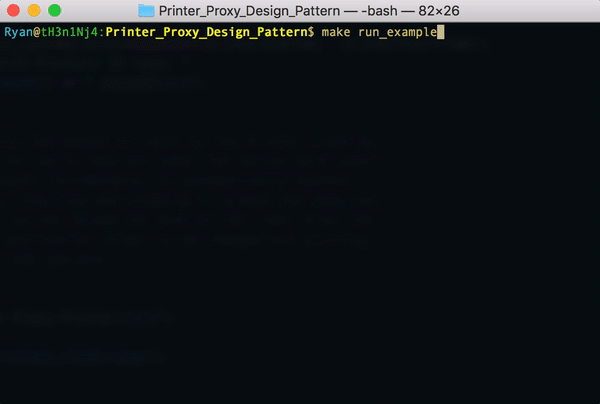
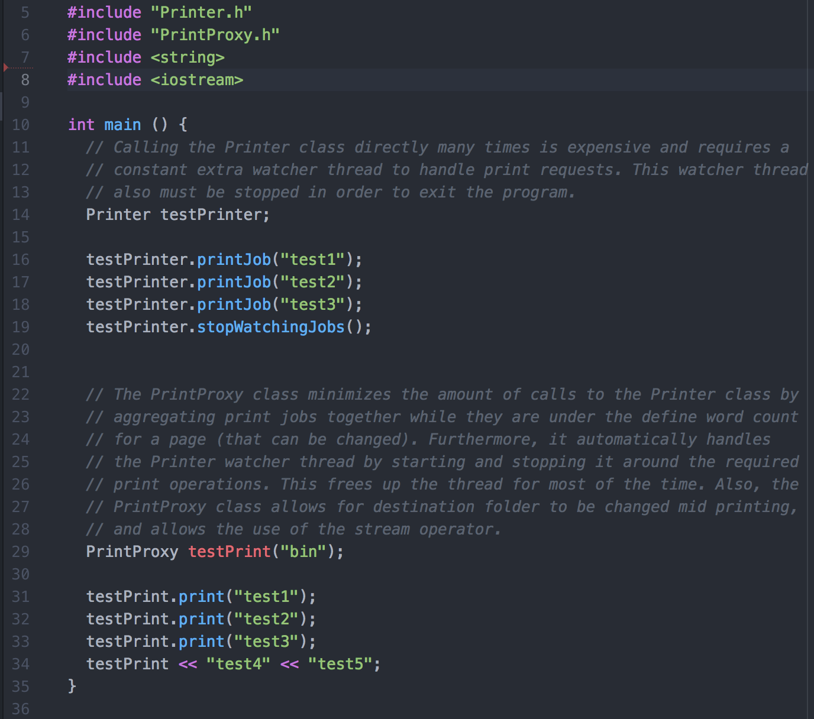

# Printer Proxy Design Pattern
Users write to a proxy printer class that only sends data to the printer when there is enough to make a page. This is done to demonstrate the Proxy Design Pattern.

----

## Proxy Design Pattern:
The purpose of the Proxy design pattern is to create another layer of indirection for the client to interact with. This layer of indirection is useful for cases in which an operation is expensive in some way and adding another interface has the capability of minimizing this expense. Furthermore, by adding an intermediate proxy class, there is potential for more functionality to be added to it.

## Example Run:
Example client code was written to demonstrate the benefits of the proxy class:


As you can see, the proxy class greatly reduces time and the number of printing calls. Internally, the proxy class also slightly changes the interface to be more usable:


### Goal of Example:
In order to show the Proxy Design Pattern, a mock Printer class was created to mimic an expensive operation and the PrintProxy class was made to serve as a Proxy that makes the task more efficient. For the purpose of this example, it is assumed that formatting of the printed pages is not important and that it doesn't actually matter which page information is on, as long as it is on a page that will be printed in as contiguous of a block as possible.

## Building and Executing the Example:
A make file was created for convenience when running the example. To build the example, in the root directory of the project run:
```sh
make example
make run_example
```
To run tests type:
```sh
make unit_tests
make run_tests
```
Finally, to clean up temporary files, run:
```sh
make clean
make clean_tests
```

## Classes:

### Printer Class:
The printer class is a mock of an actual printer. When a job is sent to it via the printJob function, it is added to an internal queue. In the constructor of the Printer class, the private watchPrintJobs function is called that makes a dedicated thread watching this queue. However, to more closely simulate a printer, this thread waits 1 second after every job and goes to sleep for 1 second if the queue is empty. Instead of printing, this class mocks this process by writing to sequentially numbered files. This in conjunction with the sleeping makes any individual calls to this class very expensive time wise and memory wise.

### PrintProxy Class:
In order to demonstrate the Proxy design pattern, the PrintProxy class was created. When the client prints to this class, it stores the string in an internal buffer that witholds printing to the Printer class until it either gets larger than a specified max character count per page, the client calls the flush function directly, or the destructor is called. Furthermore, this class makes printing using the Printer class less memory intensive. It does this by only turning on the watchPrintJobs function for the Printer class when it flushed a request. After the request is sent, it calls the stopWatchingJobs function to conserve memory. Other features this proxy class adds are acting as a stream so that the stream operator can be used on it, allowing the print directory to be changed after construction, and the ability to change the maximum character count per page.

#### Added Functionality:
Besides making the task of printing more efficient, the PrintProxy class also adds extra functionality. This functionality includes:
-  Overloading the stream operator so that it acts like a stream:


- Changing the print directory:


- Setting the maximum characters per print file:


## Testing:
In the interest of following best practices, the Catch2 testing framework is being used for unit testing of the Printer class. Since the nature of the Printer class deals with fundamentally low level concepts such as multithreading and potential race conditions, testing proved to be very helpful in ensuring a viable product.
